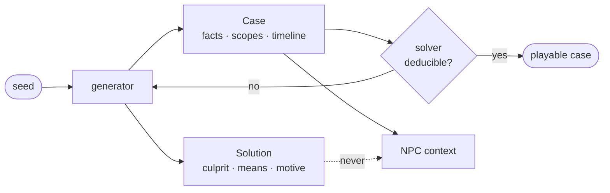

# Firenze

An investigative mystery game where the suspects are LLM-driven NPCs. You
question them in free text, confront them with evidence, and name a culprit.

The chat is the easy part. The hard part is generating mysteries that are
actually solvable, and keeping a language model from telling you something its
character has no way of knowing.


> **Status: a match runs end to end.** Generate a case, question six suspects,
> break an alibi with evidence, accuse once, and read a verdict computed by
> code. The words are still synthetic — the model provider (Magalu Prosa) is in
> pilot — so the mechanics are playable and the prose is not yet worth reading.

## See it work

```console
$ make case SEED=42 LOCALE=en

Case 42 (generator v2, en)

CAST
  victim   Rodolfo Andrade (victim)
  sus-1    Vitória Belmiro
  sus-2    Clarice Antunes
  sus-3    Teodoro Mainz
  sus-4    Godofredo Alves
  sus-5    Ilma Prado
  sus-6    Nazareno Cruz

WHAT IS KNOWN
  F-001  Rodolfo Andrade's body was found in the conservatory, around 9:30 pm.

DOSSIERS (what each suspect knows)
  sus-1 — Vitória Belmiro: 7 facts
  sus-2 — Clarice Antunes: 4 facts
  sus-3 — Teodoro Mainz: 10 facts
  sus-4 — Godofredo Alves: 5 facts
  sus-5 — Ilma Prado: 8 facts
  sus-6 — Nazareno Cruz: 8 facts

Solution withheld. Use --reveal to see it.
```

Six dossiers, six different sizes. Nobody sees the same night, and nobody sees
the answer — including the code that builds their context.

Add `REVEAL=1` and the solver shows its work:

```console
SOLVER
  deducible: True
  deduced: sus-1
  chain: F-001, F-005, F-006, F-007, F-008, F-009, F-022

SECRETS (why the innocent lie)
  sus-2: Clarice Antunes was keeping objects that did not belong to them — and was in the wine cellar at 9:00 pm.
  sus-3: Teodoro Mainz forged a signature in the ledger — and was in the study at 10:30 pm.
  sus-5: Ilma Prado was hiding gambling debts — and was in the study at 10:00 pm.
```

Every innocent has a secret that has nothing to do with the murder. Without
that, the game collapses into *whoever looks nervous did it*.

## What is hard here

### A mystery nobody can solve is a broken game

Roughly half of the mysteries you get by sampling constraints at random are
unsolvable, and they *look* fine until a player wastes an hour on one. So a case
is not publishable until an automated solver proves a deduction path exists.

[`generation/solver.py`](apps/api/src/firenze/generation/solver.py) takes `Case`
and never `CaseWithSolution` — it cannot read the answer, and the type signature
is what guarantees that rather than the discipline of whoever writes the next
function. It starts from the public facts, adds everything a suspect would
reveal if asked, and only approves when exactly one suspect is left without an
alibi and physical evidence points at them. A case that fails is discarded and
regenerated.

### Isolation is a data boundary, not a prompt instruction

"Do not reveal the solution" in a system prompt is a wish. The solution is a
separate entity from the case, so the function that assembles an NPC's context
takes a type that has no path to the culprit
([`domain/models.py`](apps/api/src/firenze/domain/models.py)).



Every secret fact also carries a canary token. A canary appearing in model
output is a critical failure: the response is discarded and the incident logged.
The CI gate for leakage is 0% and it blocks merges.

Player input is classified before any character hears it, and a message labelled
an injection never reaches the NPC model at all
([ADR-0010](docs/adr/0010-classify-before-the-character-hears-it.md)). The
classifier is shown one sentence and nothing else — it is a deliberately poor
target, because a model with no secrets cannot be talked out of any.

### The model narrates; it never decides

Verdict, score and contradiction detection are deterministic code comparing
structured fields. The model receives a finished outcome and writes it up.

The strongest form of that guarantee is not a test that no function calls a
model — it is that [`verdict.py`](apps/api/src/firenze/verdict.py) **cannot
import one**, and a test reads the source to confirm it. An invariant kept by
convention is an invariant broken by convenience.

A side effect worth naming: because nothing in the deduction path parses prose,
the whole thing is language-independent for free
([ADR-0005](docs/adr/0005-locale-is-a-property-of-the-match.md)).

### Determinism is what makes evaluation possible

Same seed, same generator version, same case — down to the canary tokens. Every
eval runs five times because temperature > 0 makes a single run inconclusive; if
the mystery also varied per run, a prompt regression would be indistinguishable
from a harder case.

## Run it

Requirements: [uv](https://docs.astral.sh/uv/), `make`, and Docker if you want
the database.

```bash
make install                      # sync the environment from uv.lock
make case SEED=42 REVEAL=1        # generate a case and see the solver's chain
FIRENZE_MODEL_PROVIDER=fake \n  make ask SEED=42 WHO=sus-1 Q="onde você estava às 22h?"   # question a suspect, offline
make check                        # lint, typecheck, tests — what CI enforces

make dev                          # Postgres 16 + pgvector, Redis, the API
curl localhost:8000/health
```

`make dev` is meant to be enough: the container migrates on boot and defaults
to the fake model, so a fresh clone gets a stack you can play against without a
key. CI plays a turn through it on every pull request, because none of that is
code and none of it shows up in a unit test.

Or over HTTP, with the stack up:

```console
$ curl -X POST localhost:8000/matches -d '{"seed":42,"locale":"pt-BR"}'
{"id":"1ae8856a-...","turns_left":30,"cast":[...],"known":[...],"notebook":[]}

$ curl -X POST localhost:8000/matches/$ID/turns     -d '{"suspect":"sus-1","question":"onde estava as 22h?"}'
{"answered":true,"character":"sus-1","line":"...","stance":"cooperative","turns_left":29}
```

What the answer does **not** carry is the point: `lied`, `fact_referenced` and
`clue_revealed` exist, are recorded, and never cross the wire. Returning them
would hand the player a lie detector.

Accusing works two ways and commits one way. A front end can let somebody pick a
suspect and tick evidence, or let them type *"foi a governanta, por causa da
herança"* — `POST /accusation/draft` reads prose into a form, and `POST
/accusation` accepts **only the form**. There is no endpoint that accuses in
prose, so the confirmation is structural rather than a habit: an accusation is
irreversible, and a misreading should never become one.

### The front end

Requires Node 20 and [yarn](https://classic.yarnpkg.com/). With the API up:

```bash
make web-install   # yarn install, once
make web           # http://localhost:3000
```

The browser never talks to FastAPI. Everything goes through a route handler in
`apps/web/src/app/api`, which is the only place that knows the API's address —
and the place a session goes when [T-11](docs/05-threat-model.md) is closed.

The front's TypeScript types are **generated** from `apps/api/openapi.json`
(`make contracts`), never written by hand, and CI fails if the checked-in types
drift from the spec. A front that believes in an API that no longer exists is a
front whose typechecker passes.

`make` on its own lists every target.

## Layout

| Path | What lives there |
|---|---|
| [`apps/api/src/firenze/domain/`](apps/api/src/firenze/domain/) | Entities. Structure only — no prose, no rendered sentence |
| [`apps/api/src/firenze/generation/`](apps/api/src/firenze/generation/) | Generator, solver, and the invariant checks |
| [`apps/api/src/firenze/interrogation/`](apps/api/src/firenze/interrogation/) | The turn: dossier, prompt, guards, stance machine |
| [`apps/api/src/firenze/api/`](apps/api/src/firenze/api/) | HTTP. Player-facing shapes, never the domain objects |
| [`apps/api/src/firenze/storage/`](apps/api/src/firenze/storage/) | The only package that writes SQL |
| [`apps/api/src/firenze/model/`](apps/api/src/firenze/model/) | The model port. No other module names a provider |
| [`apps/api/src/firenze/i18n/`](apps/api/src/firenze/i18n/) | Message catalogs. Grammar lives here, not in the domain |
| [`apps/web/src/`](apps/web/src/) | Next.js. Types generated from the OpenAPI, never hand-written |
| [`docs/adr/`](docs/adr/) | Architecture decisions, with their downsides written down |
| [`infra/compose/`](infra/compose/) | Local Postgres with pgvector, Redis, API |

## Documentation

The design documents are in Brazilian Portuguese; the code and the ADRs are in
English ([ADR-0006](docs/adr/0006-english-in-code-portuguese-in-the-product.md)).
The glossary maps both vocabularies.

| Document | For |
|---|---|
| [`docs/00-plano-de-projeto.md`](docs/00-plano-de-projeto.md) | Scope, roadmap, method |
| [`docs/01-dominio.md`](docs/01-dominio.md) | Glossary, domain model, state machines |
| [`docs/02-regras-de-negocio.md`](docs/02-regras-de-negocio.md) | RN-001 to RN-042, each with where it is enforced |
| [`docs/03-casos-de-uso.md`](docs/03-casos-de-uso.md) | What the player sees, clicks and types |
| [`docs/05-threat-model.md`](docs/05-threat-model.md) | Threats, and the test that proves each mitigation |
| [`docs/06-plano-de-evals.md`](docs/06-plano-de-evals.md) | Metrics, gates, datasets |
| [`docs/adr/`](docs/adr/) | Why things are the way they are |
| [`CONTRIBUTING.md`](CONTRIBUTING.md) | Branch, commit and PR flow |

Business rules are referenced by number from the code (`# RN-012`) and never
transcribed — duplicated text drifts.

## Roadmap

| Phase | Scope | Status |
|---|---|---|
| 0 | Foundation — repo, docs, local stack | done |
| 1 | Case generator and deducibility solver | done |
| 2 | A single NPC: isolated dossier, structured output, streaming | |
| 3 | Security: canary, input classifier, output filter, CI gates | done |
| 4 | Full game: six NPCs, evidence, confrontation, verdict | done |
| 5–7 | Front end, observability, production | |


Built with Python and FastAPI, on Postgres with pgvector for both game state
and NPC memory. LangGraph and Next.js arrive with the phases that need them —
the roadmap above is a record of what exists, not of what is planned to.

## License

MIT — see [`LICENSE`](LICENSE).
