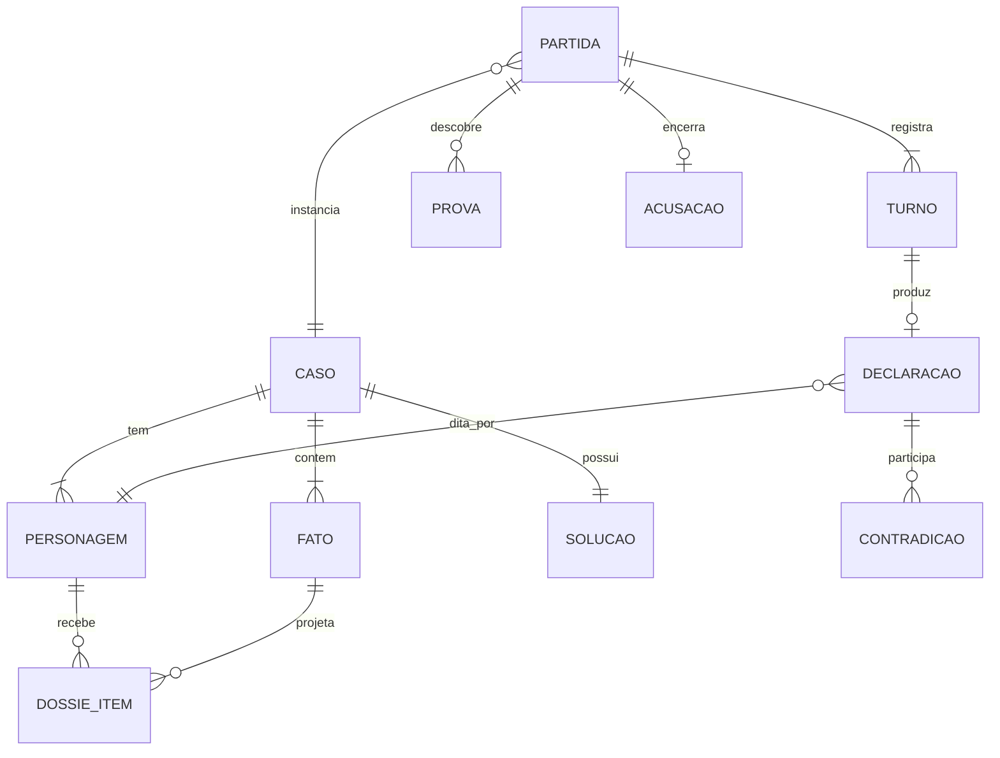
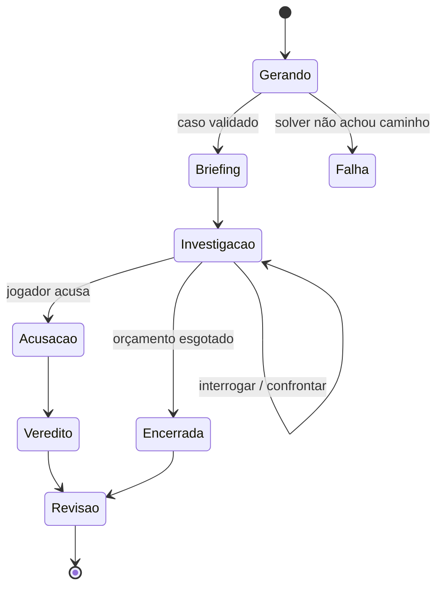
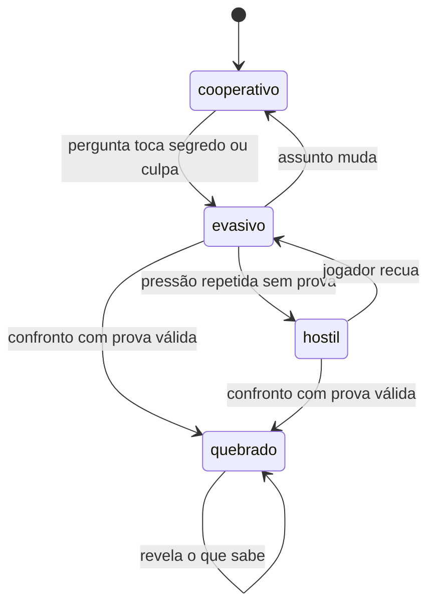

# Domínio — glossário e modelo

> Vocabulário ubíquo do projeto. Se um termo aqui aparece no código, aparece com
> este nome e este significado. Renomear termo é mudança de domínio: atualize
> este arquivo no mesmo commit.

Regras que operam sobre estas entidades: [`02-regras-de-negocio.md`](02-regras-de-negocio.md).

---

## 1. Glossário

| Termo | No código | Definição |
|---|---|---|
| **Semente** | `seed` | Valor determinístico de entrada da geração. A mesma semente e a mesma versão do gerador produzem o mesmo `Caso`. |
| **Cenário** | `setting` | O mundo de onde o caso sai: quais cômodos existem, que nomes o elenco usa, que segredos cabem. Hoje só existe `manor`. Faz parte da identidade do caso junto com semente e versão do gerador. |
| **Caso** | `Case` | Instância de mistério gerada a partir de uma semente. Contém elenco, linha do tempo e solução canônica. É imutável depois de publicado. |
| **Personagem** | `Character` | Suspeito, vítima ou figurante do caso. Suspeito é o personagem interrogável — todo suspeito tem um NPC por trás. |
| **Fato** | `Fact` | Unidade atômica de verdade sobre o caso, com escopo de visibilidade. É o único tipo de coisa que pode entrar na memória de um NPC. |
| **Escopo** | `Scope` | Conjunto de agentes autorizados a conhecer um fato. `publico` = todos; caso contrário, lista explícita de personagens. |
| **Solução** | `Solution` | Culpado, meio, motivo e a cadeia de dedução que leva até eles. Entidade separada do `Caso` justamente para nunca ser projetada em dossiê. |
| **Dossiê** | `Case.dossier()` | Projeção dos fatos visíveis para um NPC específico. Nunca contém a `Solução`. É o que o backend monta a cada turno para compor o contexto. |
| **Partida** | `Match` | Instância jogável de um caso por um jogador. Guarda orçamento, turnos, provas e postura de cada NPC. |
| **Turno** | `Turn` | Uma interação jogador → NPC → resposta. Unidade de orçamento e unidade de trace na observabilidade. |
| **Declaração** | `Statement` | Afirmação que um NPC fez ao jogador, persistida e indexada. É a matéria-prima da detecção de contradição. |
| **Contradição** | `Contradiction` | Par de declarações do mesmo NPC logicamente incompatíveis. Detectada por código, não pelo LLM. |
| **Prova** | `Evidence` | Fato descoberto pelo jogador, utilizável em confronto. Um fato só vira prova depois de descoberto. |
| **Confronto** | `Confrontation` | Ação de apresentar uma prova a um NPC, alterando sua postura. Custa mais que uma pergunta. |
| **Postura** | `stance` | Estado emocional/estratégico do NPC (`cooperativo`, `evasivo`, `hostil`, `quebrado`). Transita por máquina de estados determinística. |
| **Quebra de álibi** | `alibi_broken` | Evento de jogo em que um confronto invalida declaração anterior do NPC. É progresso, não bug. |
| **Acusação** | `Accusation` | Escolha final do jogador: um culpado e as provas de apoio. Uma por partida, irreversível. |
| **Veredito** | `Verdict` | Resultado calculado por código comparando a `Acusação` com a `Solução`. O LLM só narra o desfecho já decidido. |
| **Canary** | `canary` | Token único inserido em dado secreto, usado para detectar vazamento. Presença na saída é falha crítica. |
| **Solver** | `solve()` | Verificador automático que prova que o caso é dedutível a partir dos fatos públicos. Portão de publicação do caso. |
| **Agent card** | — | Ficha versionada de um NPC em `docs/agents/<id>.md`: personalidade, objetivo oculto, fatos conhecidos, condição de quebra. |

### Termos que evitamos

- **"IA"** como sujeito de frase (*"a IA decide"*). Diga qual componente: gerador,
  classificador de entrada, NPC, narrador do veredito. Cada um tem garantias
  diferentes.
- **"Memória"** sem qualificar. Existe memória de NPC (declarações + dossiê) e
  estado de partida. Não são a mesma coisa e não têm o mesmo isolamento.
- **"Prompt injection"** para qualquer coisa hostil. Reserve para o que o
  classificador rotula como `injecao`; o resto é `meta` ou pergunta difícil.

---

## 2. Convenções de identificador

| Prefixo | Domínio | Exemplo |
|---|---|---|
| `F-` | Fato | `F-014` |
| `P-` | Prova | `P-004` |
| `RN-` | Regra de negócio | `RN-012` |
| `T-` | Ameaça do threat model | `T-02` |
| `US-` | User story | `US-031` |
| `ADR-` | Decisão arquitetural | `ADR-0002` |

Fatos e provas são numerados por caso, não globalmente. `RN-`, `T-`, `US-` e
`ADR-` são globais e nunca reaproveitados: regra revogada fica no documento com
status `revogada` e o motivo.

No código, os nomes ficam em **inglês** (ADR-0006): `Case`, `Fact`,
`dossier()`, `stance="evasive"`. Este documento continua em português e é a
ponte entre os dois vocabulários — a coluna "No código" abaixo é normativa.
Traduzir pela metade produz `FactRepository.buscar_por_escopo`, que é o pior dos
dois mundos.

Conteúdo do jogo continua em português onde é ambientação: nomes de personagem,
a mansão, o catálogo `pt-BR` (ADR-0005).

---

## 3. Modelo de domínio



### Leitura das relações que não são óbvias

- **`SOLUCAO` é entidade própria, não campo de `CASO`.** Separar permite carregar
  o caso sem carregar a solução — o isolamento vira consulta, não disciplina
  (RN-011). Nenhum caminho de código que monta contexto de NPC tem `Solucao` no
  seu tipo de retorno.
- **`DOSSIE_ITEM` é a materialização do escopo**, não uma view calculada em
  tempo de prompt. Um fato só chega ao NPC se existe linha ligando fato a
  personagem. Bug de escopo passa a ser bug de dados, auditável por query
  (RN-010).
- **`DECLARACAO` pertence ao turno e ao personagem**, não à partida diretamente.
  É o que permite detectar contradição por NPC sem varrer a partida inteira.
- **`PROVA` pende da partida, não do caso.** O mesmo fato é prova numa partida e
  desconhecido em outra; o que muda entre partidas é a descoberta, não o caso.
- **`CONTRADICAO` liga duas declarações**, ambas do mesmo personagem. Contradição
  entre NPCs diferentes não é contradição — é o jogo funcionando.

---

## 4. Escopo e visibilidade

O modelo de isolamento tem três camadas, e elas não se substituem:

```
Fato (escopo)  ──projeção──▶  Dossiê do NPC  ──montagem──▶  contexto do turno
     │                             │                              │
  dado                          consulta                      prompt
```

1. **Dado.** Cada fato nasce com escopo. Fato secreto nasce com canary (RN-012).
2. **Consulta.** O dossiê é montado por escopo. É aqui que o isolamento acontece
   — não no prompt.
3. **Prompt.** O system prompt reforça a persona, mas **não é** a fronteira de
   segurança. Prompt hardening é defesa em profundidade; a fronteira é a
   ausência do dado no contexto ([`ADR-0007`](adr/) quando escrito).

A saída percorre o caminho inverso: filtro de canary e checagem de escopo antes
de chegar ao cliente (RN-042).

---

## 5. Máquina de estados da partida



`Gerando → Falha` não é erro de sistema: é o solver reprovando um caso
insolúvel (RN-002). A resposta é regerar com nova semente, não afrouxar a
validação.

`Investigacao → Acusacao` é irreversível (RN-031). A transição consome a
acusação; não existe caminho de volta.

## 6. Máquina de estados da postura



O LLM **sugere** a postura no campo `postura` da saída estruturada; o backend
valida a transição contra esta máquina e mantém a atual se a sugestão for
inválida (RN-023). `quebrado` é absorvente: NPC quebrado não volta a mentir
sobre o fato que a prova invalidou.
